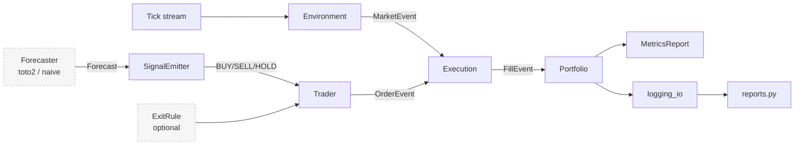
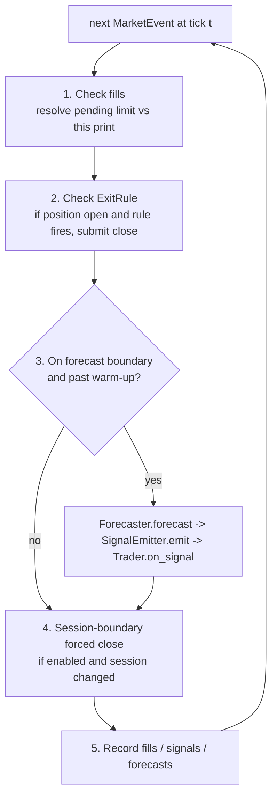

# forecast_eval — documentation hub

A trading-evaluation harness for futures forecasting models, targeting TXF
(Taiwan Stock Exchange Futures) with `toto2` as the reference forecaster.

> **What it answers:** given a forecast model, how much PnL is realizable after
> realistic execution costs, and how much of the model's predictive edge survives
> the trader and execution layers to the final result?

This folder is the **fast-orientation layer**: one page per Python file, each
telling you *what the file owns* and *which file to open next*. For the full
design rationale see [SPEC.md](../SPEC.md); for how to run things see
[usage.md](../usage.md); for environment/interpreter notes see
[CLAUDE.md](../CLAUDE.md).

---

## Architecture at a glance

**Separation of concerns:** the forecasting model, the signal logic, the trader,
and the execution simulator are independent layers — each swappable behind an
abstract interface, so any one can be evaluated in isolation.

## The per-tick event loop

Every `MarketEvent` flows through these five steps in
[run_backtest](run.md) (SPEC §4.1):

Three invariants make this honest (all enforced in code + tests):

- **Look-ahead defense** — the forecaster is handed a freshly-built frame of
  history *through t only*; a runtime guard rejects any forecast stamped past t.
- **Same-tick fill guard** — an order placed at tick t never fills against t's own
  print.
- **No-flip rule** — a SELL while long closes only (never flips to short); same for
  BUY while short. No pyramiding in v1.

---

## File map — open this when…

| File | Role | Open it when you want to understand… |
|---|---|---|
| [events.py](events.md) | Event dataclasses | the data contracts that flow between every layer |
| [environment.py](environment.md) | Tick replay + DAY/NIGHT | how raw ticks become `MarketEvent`s and session tagging |
| [execution.py](execution.md) | Fill simulator | how marketable/passive fills and fees are inferred |
| [portfolio.py](portfolio.md) | Position + PnL accounting | how realized/unrealized PnL and session buckets are kept |
| [trader.py](trader.md) | Signal→order state machine | the no-flip rule and order placement |
| [run.py](run.md) | Backtest driver + demos | the per-tick loop and how everything is wired |
| [metrics.py](metrics.md) | Metric pack | trading metrics, forecast quality (IC), attribution |
| [logging_io.py](logging_io.md) | Artifact writers | the parquet/CSV bundle and `params.json` |
| [reports.py](reports.md) | Charts (PNG + HTML) | equity/drawdown, price+fills, signal-vs-realized |
| [forecaster/base.py](forecaster/base.md) | Forecaster ABC + look-ahead helper | the model contract and the leak guard |
| [forecaster/naive.py](forecaster/naive.md) | Predict-last-price baseline | the zero-skill floor model |
| [forecaster/toto2.py](forecaster/toto2.md) | Toto-2.0 adapter | how the real model is fed and read |
| [strategy/base.py](strategy/base.md) | SignalEmitter ABC | the forecast→signal contract |
| [strategy/dummy.py](strategy/dummy.md) | Alternating emitter | the model-less Phase-1 sanity signal |
| [strategy/threshold.py](strategy/threshold.md) | Threshold emitter | how predicted return becomes BUY/SELL/HOLD |
| [exits/base.py](exits/base.md) | ExitRule ABC + PositionState | the risk-exit contract |
| [exits/stop_loss.py](exits/stop_loss.md) | Fixed stop-loss | the N-tick adverse-excursion exit |
| [exits/time_stop.py](exits/time_stop.md) | Time stop | the max-bars-in-trade exit |
| [data/loader.py](data/loader.md) | Tick CSV loaders | the RPT and generic tick file formats |
| [run.py](run.md) — `python -m forecast_eval.run` | Phase 1–4 synthetic demos | a no-model, seconds-long smoke run |
| [real_data_demo.py](real_data_demo.md) | Toto2 on real 1-min bars | the standard real-data backtest |
| [real_data.py](real_data.md) | Full-dataset run with warmup split | the whole-history variant |
| [compare_models.py](compare_models.md) | Model-size sweep | forecast-quality + backtest across checkpoints |
| [test_toto2.py](test_toto2.md) | Toto2 smoke test | the smallest "is the model wired up" check |
| [tests/](tests.md) | Unit + integration suite | what's covered and how to run it |

> `__init__.py` files (`forecast_eval/__init__.py`, and the package `__init__.py`
> under `data/`, `forecaster/`, `strategy/`, `exits/`, `tests/`) are empty or
> near-empty package markers — nothing to document.

---

## Recommended reading order

For a newcomer grasping the codebase from scratch:

1. **[events.py](events.md)** — the vocabulary (MarketEvent, Forecast, Order, Fill).
2. **[environment.py](environment.md)** — where ticks come from.
3. **[execution.py](execution.md)** — the fill rules (the trickiest, most-tested logic).
4. **[portfolio.py](portfolio.md)** + **[trader.py](trader.md)** — accounting + the state machine.
5. **[run.py](run.md)** — how steps 1–4 are wired into the per-tick loop.
6. **[forecaster/base.py](forecaster/base.md)** → **[strategy/base.py](strategy/base.md)** → **[exits/base.py](exits/base.md)** — the three pluggable contracts.
7. **[metrics.py](metrics.md)** — how a finished run is scored.
8. The concrete implementations ([forecaster/toto2.py](forecaster/toto2.md), [strategy/threshold.py](strategy/threshold.md)) and entry points ([real_data_demo.py](real_data_demo.md), [compare_models.py](compare_models.md)).

## Entry points (runnable)

| Command | Script | SPEC phase | Needs Toto2? |
|---|---|---|---|
| `python -m forecast_eval.run` | [run.py](run.md) | Phases 1–4 demos | No |
| `python -m forecast_eval.test_toto2` | [test_toto2.py](test_toto2.md) | model smoke test | Yes |
| `python -m forecast_eval.real_data_demo` | [real_data_demo.md](real_data_demo.md) | real-data backtest | Yes |
| `python -m forecast_eval.real_data` | [real_data.md](real_data.md) | full-dataset backtest | Yes |
| `python -m forecast_eval.compare_models` | [compare_models.md](compare_models.md) | Phase 5 sweep | Yes |
| `python -m pytest forecast_eval/tests/` | [tests/](tests.md) | validation | No |
